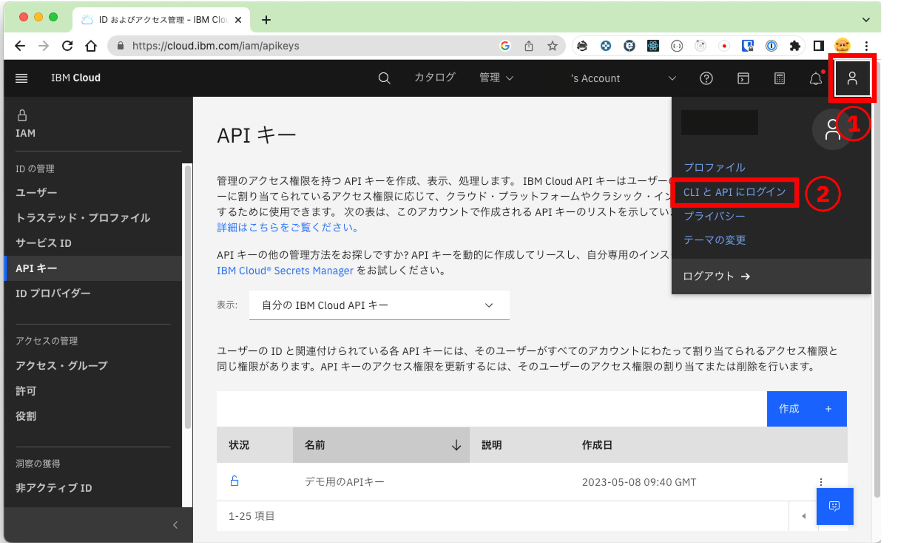
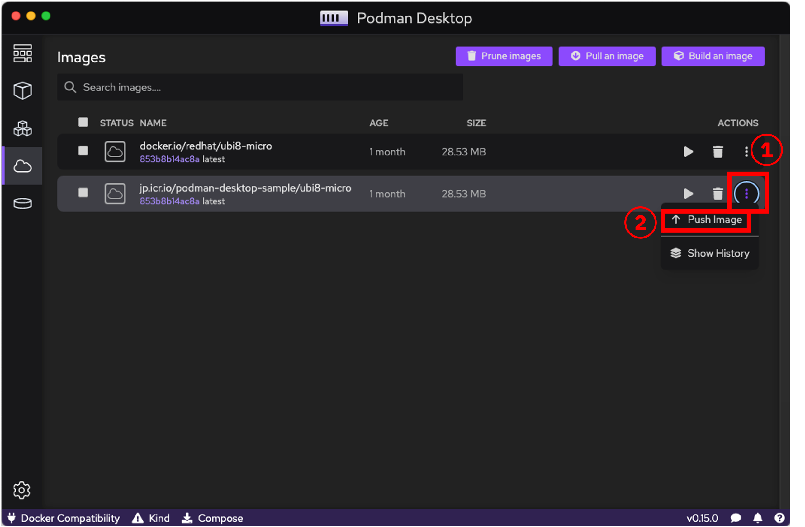

# podman_desktop

## 事前準備

1. Podman Desktopのインストール
   - Windowsの場合[リンク](https://qiita.com/youn0810/items/4e7ca4050413f3c6df08)
   - Macの場合[リンク](https://qiita.com/LgmQue/items/a01367a49b973ee31a2f)
1. IBM Cloudのアカウント

## イメージのPULL
まずはコンテナの元となるイメージをPULLします。
左側にあります、メニューバーから **Images** をクリックします。（図①）
Images画面表示後、画面上部にあります **Pull an image** をクリックします。（図②）


**Image to Pull** にPULLしたいイメージを入力します。（図①）


今回はサンプルにありました、`redhat/ubi8-micro`を入力します。
その後、下部にあります **Pull image** をクリックします。（図①）


イメージのPULLが開始されると **Pull image** 下部に実行状況が出力されます。
PULLが完了すると **Pull image** から **Done** に変わるので、 **Done** をクリックします。（図①）


Images画面に戻ると、イメージがPULLされたことを確認できます。（図①）


CLIで同様の処理を行う場合は下記のコマンドを実行する必要があります。
```
podman pull redhat/ubi8-micro
```

## イメージの削除
イメージを削除する方法は以下の3つとなります。
1. 個別削除
1. 選択削除
1. 全削除（※未実行イメージのみ）

### 1. 個別削除
イメージの右側にある **ゴミ箱アイコン** をクリックすると、該当イメージを削除できます。（図①）


CLIで同様の処理を行う場合は下記のコマンドを実行する必要があります。
```
podman rmi docker.io/redhat/ubi8-micro
```

### 2. 選択削除
削除したいイメージの左側にある **チェックボックスにチェック** をし（図①）、検索テキストボックス右側に表示される **ゴミ箱アイコン** をクリックすると、選択したイメージを削除できます。（図①）


CLIで同様の処理を行う場合は下記のコマンドを実行する必要があります。
```
podman rmi registry.access.redhat.com/ubi7 docker.io/library/my-custom-image
```

### 3. 全削除（※未実行イメージのみ）
Images画面右上部にある **Prune images** をクリックします。（図①）


CLIで同様の処理を行う場合は下記のコマンドを実行する必要があります。
```
podman rmi -a
```

確認メッセージが表示されるので **Yes** をクリックすると、全ての未実行イメージを削除できます。（図①）


## イメージのビルド
イメージはPULLするだけでなく、Containerfile（Dockerfile）を使用してビルドすることもできます。

Images画面右上部にある **Build an image** をクリックします。（図①）


**Containerfile path**をクリックするとファイル選択画面が表示されるので、ビルド対象のContainerfileを選択します。（図①）


Containerfileを選択すると、 **Build context directory** にContainerfileのパスが自動でセットされます。
変更したい場合は **Build context directory**をクリックするとディレクトリ選択画面が表示されるので、ビルドコンテキストディレクトリを選択します。（図①）
**Image Name**には新しいイメージ名を入力します。（図②）
各種入力後、 **Build** をクリックすると、ビルドが開始されます。（図③）


ビルドが開始されると実行状況が出力されます。
ビルドが完了すると **Done** が表示されるので、 **Done** をクリックします。（図①）


Images画面に戻ると、イメージがビルドされたことを確認できます。（図①）


CLIで同様の処理を行う場合は下記のコマンドを実行する必要があります。
```
podman build -t my-custom-image -f C:\Dojo\20230526\Dockerfile C:\Dojo\20230526
```

## コンテナRUN
イメージを使ってコンテナを起動します。

コンテナ起動したいイメージの右側にある **再生アイコン** をクリックします。（図①）


コンテナ起動に必要な構成情報を設定します。

**Container name** にコンテナ名を入力します。（図①）


コンテナからホストPCのディレクトリにアクセスできるようにしたい場合、 **Volumes** の **Path on the host** にホストPCのディレクトリ（図①）を、 **Path inside the container**にコンテナのディレクトリを入力します（図②）
**Path on the host** については右側にある **ディレクトリアイコン** をクリックすると、ディレクトリ選択画面が表示され、GUIによるディレクトリの選択が可能です。
追加で設定を行いたい場合、右側にある **+アイコン** をクリックすると追加設定用の入力欄が表示されます。（図③）


**Port mapping** には設定が必要なポートが表示されるので、該当するホストPCのポート番号を入力します。（図①）
追加でポートの設定を行いたい場合、 **Add custom port mapping** をクリックすると追加設定用の入力欄が表示されます。（図②）


環境変数を設定する場合は**Environment variables** の **Name** に環境変数名（図①）、 **Value** に値を入力します。（図②）


必要に応じて、その他のタブの設定も行います。

構成情報の設定が完了したら、 **Start Container** をクリックします。（図①）


Containers画面が表示され、時間経過とともにコンテナが起動されたことを確認できます。（図①）


コンテナ名をクリックして、コンテナの詳細を確認してみます。
**Inspectタブ** をクリックすると、該当コンテナのyamlを確認することができます。


35行目等で **Container name** （図①）、45行目等で **Volumes** （図②）の入力内容を確認することができます。


53～72行目等で **Port mapping** の入力内容を確認することができます。（図①）


195行目等で **Environment variables** の入力内容を確認することができます。（図①）


Webブラウザからもコンテナが起動されたことを確認してみます。
http://localhost:8080 を開くと"JBoss EAP 6"のTOPページが表示されます。


CLIで同様の処理を行う場合は下記のコマンドを実行する必要があります。
```
podman run -d --name dojo20230526 -v C:\Dojo\20230526:/usr/dojo20230526 -p 8080:8080 -p 9990:9990 -p 9999:9999 -e ENV_NAME=test docker.io/library/my-custom-image:latest
```

## コンテナレジストリの準備

IBM Cloudにログインし、左上のナビゲーションメニューを選択し、[Container Registry] > [名前空間]をクリックします。</br>


> **Note**</br>
> Container Registryのサービスが未作成の場合は作成をしてください。</br>
> 動作確認はライトプランで実施しています。

ロケーションは __東京__ を指定し、[作成]をクリックします。</br>


名前を入力し、[作成]をクリックします。</br>


> **Note**</br>
> 今回はpodman-desktop-sampleという名前空間を使用します。</br>
> 名前空間は一意である必要があるため、ご自身の環境で試す際は違う名前を指定し作成・使用してください。

## 認証情報の作成

名前空間が作成できたら、podmanコマンドでローカルのコンテナイメージをIBM CloudのコンテナレジストリにPUSHするための認証情報を準備します。

画面上部の[管理]から[アクセス(IAM)]をクリックします。</br>


管理画面が表示されたら、[APIキー]を選択し、[作成]をクリックします。</br>


ダイアログが表示されたら、APIキーの名前を入力して、[作成]をクリックします。</br>


APIキーの作成が完了したら、コピーしメモ帳などに保管＆ダウンロードをしましょう。</br>


> **Warning**</br>
> この画面を閉じると二度と中身を確認できなくなるため、忘れた場合や紛失した場合はキーを削除し、再度作成しましょう。

## コンテナレジストリへのログイン

Podman DesktopでIBM Cloudのコンテナレジストリへログインをしたいところですが、執筆時点ではできないためターミナルでコマンドを実行します。</br>
コマンドを実行し終わると、下記リストに作成した名前空間のコンテナレジストリが追加される様になります。</br>


まずはIBM Cloud CLIが必要になるため下記コマンドを実行します。
```cmd
$ ibmcloud plugin install container-registry -r 'IBM Cloud'
```

IBM Cloud CLIがインストールできたら、CLIでIBM Cloudにログインをします。</br>
IBM Cloudの右上のユーザーアイコンをクリックし、[CLIとAPIにログイン]をクリックします。</br>


ワンタイム・パスコードが表示されたら、__IBM Cloud CLI__ に表示されているコマンドをコピーします。</br>


> **Warning**
> このコマンドは第三者に共有しない様に注意してください。

コピーしたコマンドを実行します。
```cmd
$ ibmcloud login -a https://cloud.ibm.com -u passcode -p XXXXXXXXXX
API エンドポイント: https://cloud.ibm.com
認証中です...
OK

ターゲットのアカウント XXX's Account (xxxxxxxxxxxxxxxxxxxxxxx)
```

リージョンを聞かれるので、`jp-tok`を選択します。

```
リージョンを選択します (または Enter キーを押してスキップします):
1. au-syd
2. in-che
3. jp-osa
4. jp-tok
5. kr-seo
6. eu-de
7. eu-gb
8. ca-tor
9. us-south
10. us-east
11. br-sao
数値を入力してください> 4
ターゲットのリージョン jp-tok
```

無事にログインができたら下記情報が表示されます。

```                         
API エンドポイント:      https://cloud.ibm.com
Region:                  jp-tok
ユーザー:                xxx@xxx.com
アカウント:              XXX's Account (xxxxxxxxxxxxxxxxxxxxxxx)
リソース・グループ:      リソース・グループがターゲットになっていません。'ibmcloud target -g RESOURCE_GROUP' を使用してください
CF API エンドポイント:   
組織:                    
スペース:  
```

最後に先ほど作成したAPIキーを使って、PodmanでIBM Cloudのコンテナレジストリにログインをします。</br>
①にはiamapikey、②には控えておいたAPIキーを入力します。
```cmd
$ podman login jp.icr.io
Username: ①
Password: ②(入力内容は画面には表示されません)
Login Succeeded!
```

ログインができたので、Podman DesktopのRegistriesに表示されているか確認してみましょう。</br>
右下の[歯車マーク] > [Registries]をクリックします。</br>
</br>
Podman Desktopでもレジストリが表示されました。

## コンテナイメージのPUSH

今回は`redhat/ubi8-micro` のコンテナイメージを使って動作確認しようと思います。</br>
まずは[Images] > [Pull an image]からイメージをPULLします。</br>


`redhat/ubi8-micro`を入力し、[Pull image]をクリックします。</br>


完了したら[Done]をクリックします。</br>


自身のレジストリにPUSHするために、タグ付けをします。</br>
タグ付けはコマンドで実行する必要があるので下記コマンドを打ちましょう。
```cmd
$ podman tag イメージ jp.icr.io/{名前空間名}/{リポジトリー名}
```

`redhat/ubi8-micro` のコンテナイメージにタグ付けをしてみた場合は下記の様になります。
```cmd
$ podman tag redhat/ubi8-micro jp.icr.io/podman-desktop-sample/ubi8-micro
```

タグ付けができると、GUIはこの様な状態になります。</br>


それではレジストリにPUSHしましょう。</br>
ImagesにてPUSHしたいイメージのACTIONSの3点リーダーをクリックし、[Push image]をクリックします。


タグに紐づくイメージが選択できるので、`jp.icr.io/podman-desktop-sample/ubi8-micro`を選択し、[Push image]をクリックします。</br>


PUSHできました。</br>
[Done]をクリックして閉じておきましょう。</br>


CLIで同様の処理を行う場合は下記のコマンドを実行する必要があります。</br>
```cmd
podman push jp.icr.io/podman-desktop-sample/ubi8-micro:latest
```

最後にIBM Cloudのコンテナレジストリを確認してみましょう。</br>


PUSHしたイメージが確認できました、以上で終了です。
